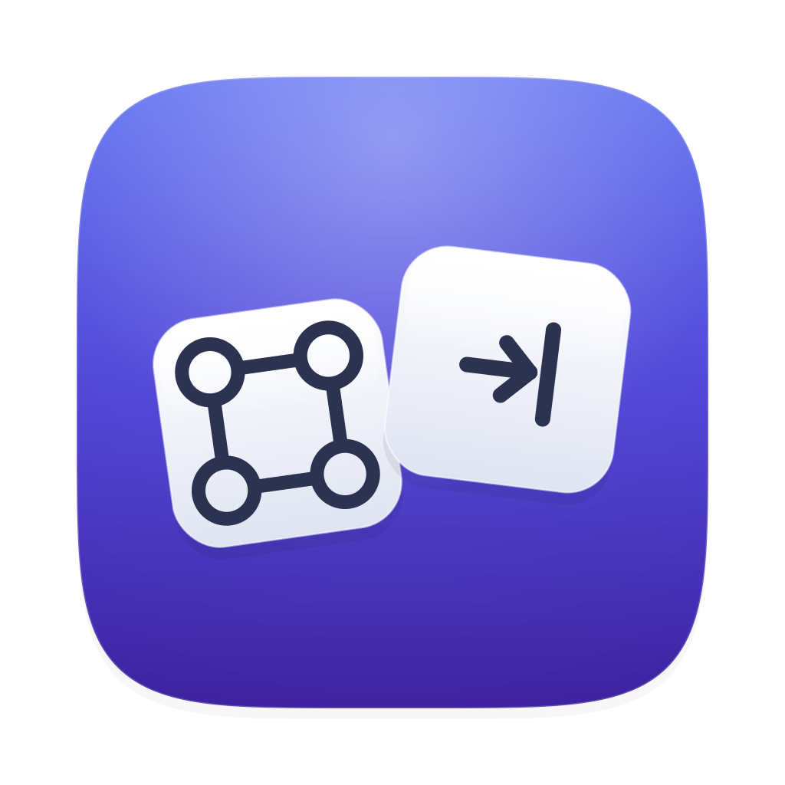

<p align="center">
  
</p>

# Cmd-Tab

A ⌘-Tab replacement for macOS, in the spirit of Command-Tab Plus 2. Switches between
**applications** or between **individual windows**, toggleable from the menu bar.

## Build

```sh
./build.sh            # produces build/Cmd-Tab.app
./build.sh --install  # also copies to /Applications and launches it
```

Requires Xcode. Built and tested against macOS 26.5 with Swift 6.3.

## First run

Grant **System Settings → Privacy & Security → Accessibility → Cmd-Tab**. Nothing happens
until you do — the app polls for the permission and stays inert meanwhile. It needs it twice
over: the event tap cannot receive keystrokes without it, and window mode cannot enumerate or
raise windows without it.

The switcher itself never needs Screen Recording: tiles are app icons, and window *titles* come
from the Accessibility API rather than `CGWindowListCopyWindowInfo`. The one exception is the
optional **window preview on hover** (Settings → Appearance) — its live thumbnails are captured
with ScreenCaptureKit, so turning it on prompts for Screen Recording. Leave it off and that second
permission is never touched.

## Keys

The trigger below is ⌘-Tab by default and rebindable in **Settings → General**. In the table it
stands in for whatever combination is bound; the held modifier is whatever that combination uses.

| Key | Action |
| --- | --- |
| ⌘-Tab | Open the switcher / advance |
| ⌘-⇧-Tab | Go backwards |
| ⌘-← / ⌘-→ | Move the selection |
| *type* | Filter the list by app / window name |
| ⌫ | Delete the last character of the filter |
| ⌘-1 … ⌘-9 | Switch straight to that tile (no filter active) |
| ⌘-⌥-Q | Quit the selected app |
| ⌘-⌥-⇧-Q | Force-quit the selected app |
| ⌘-⌥-W | Close the selected window (window mode) or the app's front window |
| ⌘-⌥-H | Hide the selected app |
| ⌘-⌥-⇧-H | Hide every other app |
| ⌘-⌥-M | Minimize the selected window |
| ⌘-⌥-F | Zoom (maximize / restore) the selected window |
| ⌘-⌥-← / ⌘-⌥-→ | Move the selected window to the previous / next **desktop** (Space) |
| ⌘-⌥-⇧-← / ⌘-⌥-⇧-→ | Move the selected window to the previous / next **display** |
| Esc | Clear the filter, or dismiss the switcher when there is none |
| Release ⌘ | Switch to the selection |

### Type to filter

While the switcher is open, just start typing to narrow the list to apps (or, in window mode,
windows) whose name contains what you typed — space-separated words each have to match, so `saf 2`
finds Safari's second window. The match is on the tile's title *and* its app name, case-insensitively.
Because you are still holding ⌘, the character each key would type is read from the event honouring
your keyboard layout, so it follows the physical keys rather than assuming a US layout.

The window actions live on ⌥ (**⌘-⌥-Q/W/H**, and the rest in the table) precisely so the bare
letters stay free for this — otherwise you could never search for a word containing q, w or h. Every
one of those bindings is rebindable in **Settings → General → Switcher shortcuts**. A digit still jumps to that
tile when the filter is empty; once you have started a query, digits type into it instead (so you can
find *1Password*). The number badges hide while a filter is active, since the jump is off. **Esc**
backs out of the query first and only dismisses the switcher on a second press, the way a search
field behaves.

The mouse works too: while the switcher is open, **moving over a tile highlights it** (the highlight
and caption follow the cursor) and **clicking a tile switches to it**. Neither goes through SwiftUI,
because the panel is deliberately non-activating and never becomes key: the highlight is driven by
polling the cursor position on a timer, and clicks are caught in the panel's `sendEvent`. The poll
is used rather than a global mouse-moved monitor because such a monitor only sees events bound for
*other* apps — so whenever Cmd-Tab itself is frontmost the highlight would stop following the cursor.
With **Preview windows on hover** enabled, pausing over an app tile also floats live thumbnails of
that app's windows beside it — see [Appearance](#appearance).

The first nine tiles carry their number in the bottom-right corner. The number switches
immediately rather than moving the highlight — waiting for ⌘ to come up would make it slower than
the arrow keys. A digit past the end of the list does nothing, but is still swallowed: letting it
through would fire ⌘-7 in whatever app is sitting behind the panel.

Tiles carry small badges besides the number: a minimized window shows a **–**, a hidden app an
**eye-slash**, a not-running favourite an **↗** (and a dimmed icon), and — in window mode with more
than one display — the window's **display number**.

Both the number row and the keypad work. The mapping is by physical key position, so it follows
the keys *labelled* 1–9 on ANSI-style layouts.

## Settings

**Menu bar → Settings…**, in three tabs.

### General

| Setting | What it does | Default |
| --- | --- | --- |
| Shortcut | The combination that opens the switcher. Click, then press a new combination — a modifier (⌘/⌥/⌃) is required, since the switcher stays open only while it is held. The native ⌘-Tab is suppressed only while the shortcut *is* ⌘-Tab; a custom combination leaves the system switcher alone. | ⌘-Tab |
| Switch between | Applications or individual windows. | Applications |
| Order | Recently used (an MRU list kept from activation notifications) or alphabetical. | Recently used |
| Skip minimized windows | Window mode only: leave minimized windows out of the list rather than showing them dimmed. | Off |
| Switcher shortcuts | The key for each in-switcher window action (quit, force-quit, close, hide, hide-others, minimize, zoom, move-to-display) is rebindable — click a row and press a new combination. ⌘ (the trigger) is always held, so a binding only records the *extra* modifiers, and needs at least ⌥ or ⌃ so it can't collide with type-to-filter. Persisted as `switcherShortcuts`. | ⌥ combos (see [Keys](#keys)) |
| Start at login | Registers the app as a login item via `SMAppService`. | Off |

Each persists in `UserDefaults` (`hotkeyKeyCode`/`hotkeyModifiers`, `mode`, `sortOrder`,
`skipMinimized`); Start at login lives in the system's Login Items, not our
defaults.

### Appearance

Four sliders, which together are the entire `Metrics` the panel lays itself out from:

| Slider | Range | Default | What it moves |
| --- | --- | --- | --- |
| Icon size | 32–128 | 64 | Icon edge length. Window mode uses 75% of it, having given up room to the title, and scales in step. |
| Icon spacing | 0–48 | 18 | Slack around each icon, inside its highlight. Sets how far apart icons sit, and stacks with panel padding at the edges. |
| Panel padding | 0–36 | 10 | The frosted border above, below and beside the tiles — this is padding *inside* the glass. |
| Title spacing | 0–28 | 2 | Gap between an icon and its name: the caption in app mode, the in-tile title in window mode. |

Distance from an icon to the glass is `iconSpacing / 2 + panelPadding` — the two stack, which is
why tightening only one of them disappoints. The gap between neighbouring highlights is
`iconSpacing + tileGap`, and `tileGap` is deliberately not adjustable down to zero: touching
highlights read as one smeared blob rather than two tiles.

The preview is a real panel — same glass, same metrics, real icons — because the switcher itself
cannot be seen while the settings window is frontmost. Dragging a slider also resizes an
already-open switcher live.

Each value persists in `UserDefaults` (`iconSize`, `iconSpacing`, `panelPadding`, `titleSpacing`)
and is clamped on read, so a hand-edited plist cannot produce an unusable panel.

Below the sliders are three more controls:

| Setting | What it does | Default |
| --- | --- | --- |
| Highlight colour | The tint of the selected tile. Persists as a hex string (`highlightColorHex`). | System accent |
| Appearance | Forces the panel Light or Dark, or matches the system. | Match system |
| Position | Screen centre, the active screen's centre, or near the cursor. | Screen centre |

### Window preview on hover

| Setting | What it does | Default |
| --- | --- | --- |
| Preview windows on hover | App mode only: pausing over a tile floats live thumbnails of that app's windows beside it. Persists as `windowPreviewOnHover`. | Off |

This is the one feature that uses Screen Recording. Thumbnails are captured with ScreenCaptureKit
into a second non-activating panel that never takes the mouse or keyboard, so the tile behind it —
not the preview — stays the switch target. Turning the setting on prompts for the permission; a
previous denial is routed to System Settings instead, since macOS only shows the prompt once. The
grant takes effect on the next launch, which is standard for Screen Recording.

The window list is enumerated with `onScreenWindowsOnly: false`, so windows on **other Spaces** are
included — ScreenCaptureKit captures a window's backing surface even when its Space isn't frontmost,
which is exactly what you want when previewing an app you aren't currently looking at. Ordering
follows the switcher's own Accessibility window list (the same order window mode shows) when the
window IDs resolve, and falls back to a size filter otherwise. Every capture then passes a
blank-content check — a downsampled alpha test — and anything essentially transparent is dropped.
That check is what removes the Electron/Catalyst *phantom* backing windows those apps expose (a
hidden second "window" with no real content) without needing to special-case them. The one kind of
window that can't be shown is a **minimized** one: it has no live surface, so it captures blank and
is dropped. Captures are debounced per hovered tile, run concurrently, and reuse a briefly cached
window list so a cursor sweeping across tiles does not re-enumerate the system each time.

### Apps

One list of every running app, with two controls per row. They are opposite answers to the same
question — should this app be in the switcher — so they share a row rather than two panes listing
the same apps twice.

**Favorite** (the star) pins an app. In app mode a favourite that isn't running still appears as a
launchable tile (dimmed, with an ↗ badge) at the end of the list; picking it launches the app
instead of switching.

**Exclude** (the switch) keeps an app out of the switcher in either mode — excluding an app also
removes all of its windows from window mode.

The two are mutually exclusive: setting one clears the other, so a row can never claim an app is
both pinned into the switcher and kept out of it.

Both are keyed by bundle identifier, not pid, so they survive the app quitting, relaunching under a
new pid, and Cmd-Tab restarting. They persist in `UserDefaults` under `favoriteBundleIDs` (an array,
in the order added — that is the order the launch tiles appear in) and `excludedBundleIDs`.

An app with either setting stays in the list once it quits, so the setting can always be undone; an
app that has since been uninstalled shows its raw bundle id and a placeholder icon rather than
vanishing. **Add App…** reaches an app that isn't running, since by definition it can't be in the
list — it lands as a favourite, that being the reason to reach for a non-running app, and the
switch on its row overrides that. An app with no bundle identifier can never be set either way —
there is nothing stable to key it on.

## Switching to an app whose windows are all minimized

Activating an app whose windows are *all* minimized leaves you looking at its menu bar and an
empty desktop, so app mode restores one window on the way in. If anything of the app's is already
on screen, its arrangement is left alone. Window mode does not need this — there the specific
window is unminimized by name.

The restore runs off the main thread. `focus()` is called from inside the event tap callback, and
every Accessibility call is IPC that can block on a wedged app; the system kills a tap that
stalls. It also gets its own queue rather than `TargetProvider`'s, which can be busy enumerating
every window on the system — a restore stuck behind a full refresh would land visibly late.

### The AXDialog trap

**macOS reports a window's subrole as `AXDialog` while it is minimized.** The same window flips
`AXStandardWindow` → `AXDialog` on minimize and back on restore (verified on macOS 26.5 with
TextEdit):

| State | `AXRole` | `AXSubrole` | `AXMinimized` |
| --- | --- | --- | --- |
| Up | `AXWindow` | `AXStandardWindow` | `false` |
| Minimized | `AXWindow` | `AXDialog` | `true` |

So filtering windows on `AXSubrole == AXStandardWindow` silently drops every minimized window —
silently because an empty list is indistinguishable from an app that has no windows. That filter
is why minimized windows never used to appear in window mode at all, which in turn made the
minimized badge in `SwitcherView` unreachable.

`AX.isSwitchableWindow` therefore accepts a window that is either standard *or* minimized.
`AX.isWindow` is the broader role-only check, used when deciding whether anything of an app's is
on screen: an app showing only a dialog still has something up, and restoring a minimized window
over it would be wrong. The role check is also what keeps Finder's desktop — an `AXScrollArea`
that turns up in `AXWindows` — out of the list.

Note that Finder's own browser windows report `AXDialog` even while up, so they are still missed
in window mode. Unchanged from before, and not yet fixed.

## How the ⌘-Tab takeover works

The Dock owns ⌘-Tab at a level no public API can intercept, so taking it over is two moves:

1. **Disable the system switcher** via `CGSSetSymbolicHotKeyEnabled(1, false)` and `(2, false)`
   — symbolic hot key IDs for "move focus to next/previous application". This is a private
   SkyLight entry point, the same one AltTab and Command-Tab Plus rely on.
2. **Claim the keystroke** with a session-level `CGEventTap`, which swallows ⌘-Tab before the
   focused app sees it.

The private symbol is resolved with `dlsym`, not linked. If a future macOS drops it, we lose the
takeover and log it rather than failing to launch. Verified present on macOS 26.5; note that its
sibling `CGSGetSymbolicHotKeyEnabled` is *already gone* on this OS, which is why the disabled
state is tracked in-process rather than queried back.

### Getting your ⌘-Tab back

The state lives in the window server's memory and is never written to
`com.apple.symbolichotkeys`, so **logging out always restores it**, even after a crash. Short of
that: quit Cmd-Tab, or use **Restore System ⌘-Tab** in the menu bar. Quit, SIGTERM, SIGINT and
SIGHUP all restore it on the way out. SIGKILL and hard crashes cannot — log out.

## Signing

`build.sh` signs with a self-signed certificate called **Overtab Local** — the name is left over
from before the app was renamed, and is only a keychain label. Replacing it would change the
designated requirement and cost an Accessibility re-grant for no gain.

The certificate is what keeps the Accessibility grant alive across rebuilds. macOS keys the
permission to the app's *designated requirement*; signed with a certificate, that requirement is

```
identifier "com.cmdtab.CmdTab" and certificate leaf = H"<cert hash>"
```

— no code hash, so recompiling does not invalidate it. Ad-hoc signing has no certificate, so the
requirement falls back to the code hash and every build looks like a brand new app. `build.sh`
falls back to ad-hoc if the identity is missing, and says so.

To recreate the identity on another machine (or after deleting it):

```sh
openssl req -x509 -newkey rsa:2048 -sha256 -days 7300 -nodes \
  -keyout key.pem -out cert.pem \
  -subj "/CN=Overtab Local" \
  -addext "basicConstraints=critical,CA:false" \
  -addext "keyUsage=critical,digitalSignature" \
  -addext "extendedKeyUsage=critical,codeSigning"

# -legacy and a non-empty password are both required; the security tool cannot read
# OpenSSL 3's default PKCS#12 encryption, and rejects an empty-password MAC.
openssl pkcs12 -export -legacy -inkey key.pem -in cert.pem \
  -out cmdtab.p12 -name "Overtab Local" -passout pass:cmdtab

security import cmdtab.p12 -k ~/Library/Keychains/login.keychain-db \
  -P cmdtab -T /usr/bin/codesign
# Trust is scoped to code signing only; without it codesign reports CSSMERR_TP_NOT_TRUSTED.
security add-trusted-cert -r trustRoot -p codeSign \
  -k ~/Library/Keychains/login.keychain-db cert.pem
```

Changing the certificate changes the requirement, so Accessibility has to be granted once more
after that. Remove the identity in Keychain Access to undo it.

## Known limitations
- Per-window ordering within an app is a best-effort MRU: it is updated when an app activates (which
  fires when you click into a window or switch to it), read from that app's focused window. Switching
  between windows of the *same, already-active* app by clicking doesn't fire an activation, so that
  case falls back to Accessibility z-order until the next activation catches up. Cross-app ordering
  is full MRU, tracked from activation notifications.
- Windows on other Spaces are listed, and switching to one follows macOS's normal Space-switch
  behavior. The hover preview shows them too — only *minimized* windows can't be previewed, since
  they have no live surface to capture.
- Moving a window to another **desktop** (Space) is on ⌘-⌥-←/→ and uses a private SkyLight call
  (`SpaceMover`) — there is no public API, so like the ⌘-Tab takeover it is resolved at runtime and
  no-ops if a future macOS drops the symbol. Moving to another **display** is on ⌘-⌥-⇧-←/→ and
  raises + activates the window on arrival so it lands in front rather than behind existing windows.
- Live window thumbnails appear only in the optional hover preview (app mode); tiles themselves are
  app icons.
- The settings window is the one place Cmd-Tab activates, so while it is frontmost *we* are the
  frontmost app and a ⌘-Tab lands one target further along than usual. Close it and ordering is
  normal again.

## Layout

| File | Role |
| --- | --- |
| `SystemSwitcher.swift` | The private SkyLight shim that disables the Dock's switcher |
| `SpaceMover.swift` | Private SkyLight shim for moving a window to an adjacent Space |
| `FavoritesStore.swift` | Pinned apps that appear as launchable tiles when not running |
| `SwitcherShortcuts.swift` | Rebindable key bindings for the in-switcher window actions |
| `EventTap.swift` | Session event tap; swallows keys, self-heals if the system disables it |
| `SwitcherController.swift` | State machine — decides what to swallow and when to commit |
| `TargetProvider.swift` | Enumerates apps/windows, maintains MRU, caches off-thread |
| `SwitcherPanel.swift` | Non-activating overlay window |
| `SwitcherView.swift` | SwiftUI tile grid |
| `WindowPreview.swift` | Hover window-preview capture (ScreenCaptureKit) and its floating panel |
| `SwitchTarget.swift` | An app or window, and how to raise it |
| `AX.swift` | Shared Accessibility helpers, with the messaging timeout baked in |
| `ExclusionStore.swift` | The set of excluded apps, persisted by bundle identifier |
| `AppearanceStore.swift` | The four appearance values, persisted |
| `SettingsWindow.swift` | Settings window shell and the General tab |
| `SettingsApps.swift` | The Apps tab — the app list with its favourite and exclude controls |
| `Migration.swift` | Carries settings over from the old Overtab bundle id; deletable in time |

## Design notes

The event tap callback runs on the main run loop, and the system kills a tap that stalls. Every
Accessibility call is IPC to another process and can block on a wedged app, so enumeration never
happens inside the callback: `TargetProvider` keeps a cache refreshed off-thread from workspace
notifications, the panel opens instantly from that cache, and a fresh list folds in a moment
later without moving the highlight. Per-app Accessibility messaging is capped at 250ms so one
hung app cannot hang the switcher.

The panel is a `.nonactivatingPanel` that never becomes key. If it activated, *we* would be the
frontmost app and the switch target would be wrong. It has no key handling at all — the event tap
is the only input path.

`flagsChanged` events are never swallowed. Other apps need to track modifier state, and it
guarantees releasing ⌘ always dismisses the panel even if the state machine gets confused.

## Renamed from Overtab

The app was called Overtab until the bundle identifier changed to `com.cmdtab.CmdTab`. That
identifier is also the `UserDefaults` domain, so `Migration.swift` copies the old settings across
on first launch — otherwise every tuned value would silently vanish. It never overwrites a value
the new build already has, and runs before any store is read.

The project directory is still `Developer/Overtab`, and the Swift target is `CmdTab` because a
module name cannot contain a hyphen. Only the bundle carries the hyphenated name.
