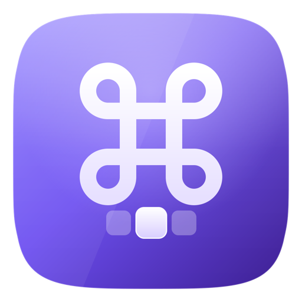

<p align="center">
  
</p>

# Cmd-Tab

A ⌘-Tab replacement for macOS, in the spirit of Command-Tab Plus 2. Switches between
**applications** or between **individual windows**, toggleable from the menu bar.

## Build

```sh
./build.sh            # produces build/Cmd-Tab.app
./build.sh --install  # also copies to /Applications and launches it
```

Requires Xcode. Built and tested against macOS 26.5 with Swift 6.3.

## First run

Grant **System Settings → Privacy & Security → Accessibility → Cmd-Tab**. Nothing happens
until you do — the app polls for the permission and stays inert meanwhile. It needs it twice
over: the event tap cannot receive keystrokes without it, and window mode cannot enumerate or
raise windows without it.

The switcher itself never needs Screen Recording: tiles are app icons, and window *titles* come
from the Accessibility API rather than `CGWindowListCopyWindowInfo`. The one exception is the
optional **window preview on hover** (Settings → Behavior) — its live thumbnails are captured
with ScreenCaptureKit, so turning it on prompts for Screen Recording. Leave it off and that second
permission is never touched.

## Keys

The trigger below is ⌘-Tab by default and rebindable in **Settings → Shortcuts**. In the table it
stands in for whatever combination is bound; the held modifier is whatever that combination uses.

| Key | Action |
| --- | --- |
| ⌘-Tab | Open the switcher / advance |
| ⌘-⇧-Tab | Go backwards |
| ⌘-← / ⌘-→ | Move the selection |
| *type* | Filter the list by app / window name |
| ⌫ | Delete the last character of the filter |
| ⌘-1 … ⌘-9, ⌘-0 | Switch straight to that tile (no filter active). 0 is the tenth tile |
| Esc | Dismiss the switcher — always, filter or not. While the panel is up it owns every key on the machine, so this is the one exit that must never depend on any other state; ⌫ is how you back out of a query |
| Release ⌘ | Switch to the selection — unless **Stay open** is on, which keeps the panel up |
| Tab (⌘ released) | With **Stay open**, switches to the selection, the way releasing ⌘ otherwise would. ⇧-Tab still steps backwards, and a session opened from the menu bar works the same way — it has no chord to release either |

### Type to filter

While the switcher is open, just start typing to narrow the list. Matching is **fuzzy and ranked**:
each space-separated word must match as a *subsequence*, so `vsc` finds Visual Studio Code and
`saf 2` still finds Safari's second window. The match is on the tile's title *and* its app name,
case-insensitively, and the better of the two scores wins so a strong title match is not diluted by
the app name trailing after it.

Ranking is the point of the scoring: a prefix beats a substring beats scattered characters, matches
at word boundaries and in consecutive runs score higher, and shorter candidates win ties. The
selection lands on the **best** match rather than the first one in list order — typing `chr` with
Character Viewer ahead of Chrome used to highlight the wrong one and make you arrow past it, which
is exactly the work filtering is meant to save.

When a query matches **nothing** running, the switcher offers installed apps to launch instead —
the moment it would otherwise have said "No matches", so nothing is displaced. Turn it off with
*Launch apps from search*.
Because you are still holding ⌘, the character each key would type is read from the event honouring
your keyboard layout, so it follows the physical keys rather than assuming a US layout.

A key held with ⌥ or ⌃ is taken as deliberate rather than typed, so it never reaches the query. A
digit still jumps to that tile when the filter is empty; once you have started a query, digits type
into it instead (so you can find *1Password*). The number badges hide while a filter is active, since the jump is off. **Esc**
backs out of the query first and only dismisses the switcher on a second press, the way a search
field behaves.

The mouse works too: while the switcher is open, **moving over a tile highlights it** (the highlight
and caption follow the cursor) and **clicking a tile switches to it**. Neither goes through SwiftUI,
because the panel is deliberately non-activating and never becomes key: the highlight is driven by
polling the cursor position on a timer, and clicks are caught in the panel's `sendEvent`. The poll
is used rather than a global mouse-moved monitor because such a monitor only sees events bound for
*other* apps — so whenever Cmd-Tab itself is frontmost the highlight would stop following the cursor.
With **Preview windows on hover** enabled, pausing over an app tile also floats live thumbnails of
that app's windows beside it — see [Window preview on hover](#window-preview-on-hover).

The first nine tiles carry their number in the bottom-right corner. The number switches
immediately rather than moving the highlight — waiting for ⌘ to come up would make it slower than
the arrow keys. A digit past the end of the list does nothing, but is still swallowed: letting it
through would fire ⌘-7 in whatever app is sitting behind the panel.

Tiles carry small badges besides the number: a minimized window shows a **–**, a hidden app an
**eye-slash**, a not-running favourite an **↗** (and a dimmed icon), and — in window mode with more
than one display — the window's **display number**.

Both the number row and the keypad work. The mapping is by physical key position, so it follows
the keys *labelled* 0–9 on ANSI-style layouts.

## Settings

**Menu bar → Settings…** opens a System Settings-shaped window: a sidebar of seven tabs, each with
its own gradient icon badge, and a search field above them. Typing in the search field replaces the
tab list with matching settings, named by the tab and section they live in; picking one switches to
that tab, scrolls to the section and outlines it for a moment.

Content is built from titled sections whose rows sit inside a rounded card — label and explanation
on the left, control on the right — so the explanation for a setting sits under it rather than in a
tooltip.

### General

| Setting | What it does | Default |
| --- | --- | --- |
| Show menu-bar icon | Off leaves no menu-bar item; reopening Cmd-Tab from Finder is then the way back to Settings. | On |
| Start at login | Registers the app as a login item via `SMAppService`. | Off |
| Menu-bar glyph | Which artwork the menu-bar item shows. The menu shows each glyph rather than only its name. | Command |
| Settings file | Export or import every preference, favourites and exclusions included, as JSON. | — |
| Reset to defaults | Clears every Cmd-Tab preference. | — |
| Keep settings in a config file | Mirrors every preference to `~/.config/cmdtab/config.json` (honouring `XDG_CONFIG_HOME`). Two-way and live: edits to the file apply without a relaunch, changes made in Settings are written back. The file is written **in place** rather than atomically, so a symlink into a dotfiles repo survives every save — an atomic write replaces the inode and would quietly break it. On launch the file wins over local defaults, which is what makes a fresh checkout come up configured. Unticking leaves the file on disk: it may be tracked, and deleting a tracked file because a checkbox changed is not ours to do. | Off |
| Sync settings over iCloud | Keeps the settings file at `~/Library/Mobile Documents/com~apple~CloudDocs/Cmd-Tab/config.json` instead, where every Mac signed into the account reads and writes the same one — a change on any of them turns up on the others, picked up by the same watcher that notices an edit made in an editor. **Independent of the switch above**: turning this on alone starts mirroring, with no need to opt into a dotfiles file first. There is only ever one mirror, so with both switches on the file lives in iCloud Drive — a second copy under `~/.config` would diverge the moment either changed, leaving two files each claiming to be the settings and nothing to say which wins. Reached by its CloudDocs path rather than through `url(forUbiquityContainerIdentifier:)`, which wants the ubiquity-container entitlement and a provisioning profile naming a team; a plain file in iCloud Drive syncs just as well, needs no entitlement, and is visible in Finder — which for a config file whose point is being editable is the better side of the trade. Turning it on with nothing in iCloud yet seeds it from the file you were using, so your settings are published rather than blanked; turning it on where a file already exists lets that file win, the same rule launch follows. An undownloaded copy (iCloud's `.config.json.icloud` placeholder) suspends writing until it lands, which is what stops a second Mac overwriting the first's settings during setup. Turning it back off leaves the cloud copy alone — the other Macs are still syncing against it. Greyed out, with the reason given, when iCloud Drive is off. Simultaneous edits on two Macs are resolved by iCloud, which keeps both and leaves a conflicted copy. | Off |
| Restore macOS ⌘-Tab | Hands the system switcher back without quitting. The takeover is otherwise undone only by a clean quit, which is no help in the case that matters — the trigger is bound to something unreachable and ⌘-Tab does nothing. Cmd-Tab keeps its own trigger, so both respond until it is restarted. | — |

Start at login lives in the system's Login Items, not our defaults.

## Signing and release

`build.sh` signs with a **self-signed** certificate called `Overtab Local`. That is deliberate for
local use: macOS keys the Accessibility and Screen Recording grants to the app's *designated
requirement*, so signing with the same certificate every time keeps both permissions across
rebuilds. Ad-hoc signing has no certificate, so the requirement falls back to the code hash, which
changes on every build — hence the re-granting. Create it once in Keychain Access → Certificate
Assistant → Create a Certificate (name `Overtab Local`, type *Code Signing*, self-signed).

That certificate is trusted by nothing else. Distributing the app needs a **Developer ID
Application** certificate (a paid Apple Developer Program membership), the hardened runtime, a
secure timestamp, and notarisation:

```sh
./release.sh                          # build + Developer ID sign + verify
./release.sh --notarize               # ... and submit to Apple, staple, re-zip
VERSION=1.2.0 BUILD=42 ./release.sh   # stamp a version into the built bundle only
```

| Variable | What it does |
| --- | --- |
| `CODESIGN_IDENTITY` | Signing identity. Defaults to the sole `Developer ID Application` in the keychain; set it when several teams' certificates are installed. |
| `NOTARY_PROFILE` | A stored `notarytool` credential profile, created once with `xcrun notarytool store-credentials`. |
| `VERSION` / `BUILD` | Override `CFBundleShortVersionString` / `CFBundleVersion` in the built bundle. The tracked `Resources/Info.plist` is never touched, so a release build leaves the working tree clean. |

Release builds are **universal** (`UNIVERSAL=1`, set by `release.sh`). A host-architecture build is
right for local work and wrong for a download: an Apple Silicon-only bundle will not launch on an
Intel Mac, and `generate_appcast` reads the slices out of the bundle and writes
`<sparkle:hardwareRequirements>arm64` into the feed, turning that into something the updater
enforces. The second slice costs about ten seconds.

Notes that cost time if missed:

- `release.sh` **refuses to fall back to ad-hoc signing**. A release that signed itself ad-hoc would
  notarise nothing and install nowhere, and would do it silently.
- Signing drops `--deep`, which Apple advises against for distribution. There is no nested code to
  need it — one executable, no frameworks, no helpers.
- No entitlements are required today: the app is unsandboxed, loads no third-party code, and reaches
  Accessibility and ScreenCaptureKit through TCC rather than entitlements. `build.sh` picks up
  `Resources/CmdTab.entitlements` automatically if that file ever appears.
- The release prints the **designated requirement**. Changing the certificate changes it, and every
  user then re-grants Accessibility and Screen Recording with no warning from anywhere else.
- Packaging uses `ditto`, not `zip`: the Notary Service needs the bundle's symlinks and extended
  attributes intact. The zip is rebuilt *after* stapling, since the ticket lives inside the bundle
  and a zip made before stapling does not carry it.
- Signing is **inside-out** and no longer uses `--deep`. See [Updates](#updates) — the bundle has
  nested code now, and signing it outside-in produces something that passes a local `codesign
  --verify` and fails notarisation.

## Updates

Cmd-Tab updates itself with [Sparkle](https://sparkle-project.org). Before that, a release was a
file on GitHub that existing installs knew nothing about: every user stayed on whatever version
they first downloaded until they happened to revisit the repository.

**Settings → About → Updates** has the three controls — check now, check automatically (on), install
automatically (off). Automatic *installation* is off by default deliberately: this app owns ⌘-Tab
for the whole machine, and replacing itself mid-session is worth a prompt.

### What makes an update safe to take

The feed is HTTPS, but that is not what the trust rests on. Every archive is signed with an
**EdDSA** key whose public half is baked into `Info.plist` as `SUPublicEDKey`, and Sparkle verifies
that signature before unpacking anything. A compromised Pages host or a hijacked download can serve
a different file; it cannot serve one this app will install.

The private half lives in the maintainer's login keychain and in the `SPARKLE_PRIVATE_KEY` repo
secret. **It is not recoverable.** Losing it means no existing install can ever be updated again —
every future release would be signed by a key they do not trust, and the only route forward is
asking every user to download a new build by hand. Back it up:

```sh
generate_keys -x sparkle-private-key.txt   # then store it somewhere real, and delete the file
```

`release.yml` checks the imported key against `SUPublicEDKey` before it builds and fails the release
if they disagree, because the alternative is a feed that looks fine and that no client will install.

### The framework, and what it cost

Sparkle ships as a binary XCFramework, so it is the first dependency to leave a mark outside the
compile. `build.sh` now has to:

1. **Copy** the macOS slice into `Contents/Frameworks`. SwiftPM links against the XCFramework but
   does nothing to embed it, so without this the app compiles, signs, launches, and dies on the
   first line that touches Sparkle with a dyld error naming a path under `.build`.
2. **Add an rpath** (`@executable_path/../Frameworks`). SwiftPM bakes in one pointing at `.build`,
   which is right for `swift run` and wrong for everything a user will do.
3. **Sign inside-out.** Sparkle is not one binary — the framework wraps `Autoupdate`, `Updater.app`
   and two XPC services, each separately signable. Signatures nest, so an inner signature
   invalidates every seal already covering it. `--deep` is gone from both paths: Apple advises
   against it for distribution, and it re-signs nested code with the *outer* options, replacing
   signatures that were built correctly with ones that were not. `build.sh` ends with
   `codesign --verify --deep --strict`, which is the check that catches the mistake locally instead
   of several minutes into a notarisation run.

**A local build never updates itself.** `build.sh` strips `SUFeedURL` from any bundle that is not a
release, so a `--install` build cannot notice that the published version is newer than the working
tree and helpfully replace what you were testing. `Updater.isConfigured` reads that absence and
greys out the controls with the reason.

### Publishing

`release.sh --notarize` ends by writing `build/releases/appcast.xml`, appending to the published
feed rather than replacing it — a regenerated appcast listing only the newest release strands
anyone more than one version behind, since an item Sparkle cannot see is an update it will never
take. Set `APPCAST_URL` to have it fetch the live feed first.

| Variable | What it does |
| --- | --- |
| `APPCAST_URL` | The published feed to append to. Skipped if unset, which starts a fresh appcast. |
| `DOWNLOAD_URL_PREFIX` | What each `<enclosure url>` is built from. Defaults to this repo's release-download path for the version being built. |

## Continuous integration

Two workflows, both on `macos-26` — pinned rather than `macos-latest`, since this project reaches
for private SkyLight symbols and has a `#available(macOS 26.0, *)` branch, and a runner a major
version behind would be testing something subtly different from what ships.

**`ci.yml`** — on every push and pull request. Builds, runs the suite, then assembles the app bundle
and checks it came out whole. That last step is not redundant with the build: the `Info.plist` copy,
the icon and the menu-bar PNG flattening are all steps that can break without the compiler noticing,
and a glyph left in a subfolder is a blank menu bar at runtime with nothing else to catch it.

The suite is worth running on every push precisely because it is cheap — 254 pure-logic tests in
about 30 milliseconds, no window server, no Accessibility grant, no running apps. The parts that
*cannot* be tested that way are the parts where a silent regression costs the most.

**`release.yml`** — on a `v*` tag. Imports the Developer ID certificate into a throwaway keychain,
imports the Sparkle key and checks it against `SUPublicEDKey`, stores notarisation credentials, runs
`./release.sh --notarize`, publishes the GitHub release, and only then pushes the appcast to
`gh-pages`. Ordering is deliberate: an appcast entry pointing at a release that failed to upload is
an update every client tries and every client fails.

It runs the same `release.sh` a maintainer runs by hand. A CI-only build path is one that stops
working without anyone noticing until the day they need it.

### Secrets it needs

| Secret | What it is |
| --- | --- |
| `DEVELOPER_ID_P12_BASE64` | The Developer ID Application certificate and key, as `base64 -i cert.p12`. |
| `DEVELOPER_ID_P12_PASSWORD` | The password set when exporting that `.p12`. |
| `KEYCHAIN_PASSWORD` | Any string. Unlocks the temporary keychain the job creates and destroys. |
| `NOTARY_APPLE_ID` | Apple ID for the Notary Service. |
| `NOTARY_TEAM_ID` | The 10-character team identifier. |
| `NOTARY_PASSWORD` | An **app-specific** password, not the account password. |
| `SPARKLE_PRIVATE_KEY` | The EdDSA private key, as printed by `generate_keys -x`. |

GitHub Pages must be serving the `gh-pages` branch for `SUFeedURL` to resolve. The workflow creates
that branch on the first release and writes a `.nojekyll` alongside the appcast, which stops Pages
running the XML through Jekyll and mangling it.

### Shortcuts

| Setting | What it does | Default |
| --- | --- | --- |
| Switcher shortcut | The combination that opens the switcher. Click, then press a new combination — a modifier (⌘/⌥/⌃) is required, since the switcher stays open only while it is held. The native ⌘-Tab is suppressed only while the shortcut *is* ⌘-Tab; a custom combination leaves the system switcher alone. | ⌘-Tab |
| Cycle app windows | A second shortcut showing only the frontmost app's windows. Off by default — ⌘-` is a shortcut apps use themselves. | Off, ⌘-` |
| Scoped shortcuts | Extra triggers that open the switcher on *part* of the window list: this app's windows, all windows, windows on the current display, or minimized windows. Held and released like the main trigger and never sticky — a scoped cycle is a jump, not a panel to browse. Unbound when added, since choosing the scope and choosing the chord are separate decisions. Persists as `scopedTriggers`. | None |
| Overview | Every binding in the app in one list, with cross-store conflicts flagged. Each pane warns about clashes inside its own store; nothing could see *across* them, and the kinds of binding are spread over several stores — a tiling chord and a direct activation on the same keys produced no warning anywhere. Shows which of a clashing pair actually fires. | — |
| In-switcher keys | The keys the panel handles while it is open, listed for reference: Tab/⇧Tab and ←/→ move the selection, Return switches, 1–9/0 jump, typing filters, ⌫ deletes a filter character, ⎋ closes. Not rebindable. | — |

### Windows

Global hotkeys that snap the **focused** window — they fire with nothing open and act on whatever
you are looking at, which is why they are not on the Shortcuts tab with the switcher's own triggers.

| Setting | What it does | Default |
| --- | --- | --- |
| Enable window tiling | The master switch for the **sizing** arrangements. **Off by default**: each binding is a real global hotkey, so while tiling is on Cmd-Tab takes those combinations away from whatever app is in front. Nothing is claimed until you ask for it. The *move* group below — Displays — is deliberately outside it: a move changes no layout, and a chord that silently did nothing because of a checkbox captioned about tiling is the failure this split exists to avoid. | Off |
| Cycle widths | Press the same half twice to step the window through ½ → ⅔ → ⅓ of the screen on that side. The cycle resets when you tile a different window or pick a different arrangement. | On |
| Gap | Space left around a tiled window, as one value on one slider, 0–100 px in steps of 2. A tile edge lying against the screen takes the **full** gap; an edge where two windows meet takes **half** of it, so neighbours sit exactly one gap apart — the same distance as each is from the outside. 0 keeps them flush. Applies to the keyboard arrangements and to drag-snapping, whose preview is inset to match so it shows where the window will actually land. Not applied to *Center* (it keeps the window's own size), *Restore* (it puts back a frame you chose) or the display moves. This is Rectangle's `GapCalculation` arithmetic, including its consequence that a middle third is half a gap wider than the outer two. Persisted as `windowTilingGap`. A version of this app briefly split the setting into four per-edge values; those keys (`windowTilingGapTop` and friends) are read once and collapsed to the widest of them, which never tightens spacing someone had deliberately opened up. | 0 (off) |
| Halves | Left, right, top, bottom. | ⌃⌘ ← → ↑ ↓ |
| Thirds | Left, middle, right — a third of the width, full height. | ⌃⌘ 1 2 3 |
| Corners | Top-left, top-right, bottom-left, bottom-right — each a quarter of the usable area. | ⌃⌘ U I J K |
| Move to previous / next display | Keeps the window's size and its relative position on the new display. ⇧ on the halves' own arrows: same key, "throw it further". Fires whether or not tiling is on. | ⌃⇧⌘ ← → |
| Snap by dragging | Drag a window to a screen edge or corner and drop it to tile there — edges give halves, the top gives maximize, corners give quarters, **the centre of the screen gives full screen**, with a translucent preview of where it will land. Grab the window **anywhere**, not just its titlebar: what tells a window drag from a text selection is not where the press landed but whether the window actually *moved* — origin changed, size unchanged — which is also how Rectangle's `SnappingManager` decides. Independent of the shortcuts, so you can have either or both. Off by default. | Off |
| Move and resize with the mouse | Hold a modifier and drag **anywhere** in a window to move it; hold the other and drag to resize from the corner of the quarter you pressed in, with the opposite corner pinned. Defaults are ⌃⌥ to move and ⌃⌘ to resize — Rectangle's — and both are recorded rather than picked from a list: click the row and hold any combination of ⌃⌥⇧⌘, released to commit. At least one of ⌃/⌥/⌘ is required, since ⇧ alone would make every drag on the machine a window drag. Unlike *Snap by dragging*, which watches passively, this one owns the drag: a real event tap swallows the mouse while the modifier is held, so a move across a document does not select text on the way. While the chord is held, the window under the cursor is **outlined** so it is never a guess which one the gesture will grab — an outline, where the snap preview is a filled block, because "this is the window" and "this is where it lands" should not look alike. **Snaps like a titlebar drag**: carry the cursor to a screen edge or corner and that zone lights up in the same overlay drag-snapping uses — let go there and the window tiles to it, gaps included — while a drop away from any edge leaves the free move or resize where you put it. Both gestures snap, since a resize dragged into a corner means what a move dragged there does. The zone geometry is shared with `DragSnap`, so an edge snaps identically however you reach it. Independent of the tiling switch. Persisted as `windowMouseDragEnabled`, `windowMouseDragMoveModifiers`, `windowMouseDragResizeModifiers`. Or skip the button entirely: **hold the chord and point**. The window under the cursor is outlined, a dot marks where the cursor started, moving away from it in any of eight directions lights up that destination, and releasing the chord snaps the window there — staying within 45pt of the dot means the whole screen. This is the gesture Rectangle Pro inherited from Hookshot, and it needs no grab at all: the window is never clicked, focused, or brought forward. The dot's colour is selectable, defaulting to the system accent; the outline and the landing block are fixed at light grey on black — Rectangle's own footprint styling (`FootprintWindow`: `borderColor = .lightGray`, `fillColor = .black`, `borderWidth = 2`, alpha `0.3`) — and are not configurable — they are large and translucent, and read as the system's own highlighting, where the dot is 14pt of solid colour and the one mark worth making yours. | Off, ⌃⌥ / ⌃⌘ |
| Maximize | Fills the *usable* area, so a maximized window sits under the menu bar rather than behind it. | ⌃⌘↩ |
| Center | Keeps the window's size and centres it; a window bigger than the screen is clamped to it. | ⌃⌘C |
| Restore previous size | Back to where the window was before you first tiled it — saved once per window, so it is not merely the previous tile. | ⌃⌘Z |
| Hide all windows | Hide every app to clear the screen to the desktop. | Unbound |
| Show all windows | Bring back exactly what Hide all hid — apps you hid yourself stay hidden, since undoing a decision this feature never made would be wrong. | Unbound |

Every binding is user-defined: click a shortcut and press a new combination, **⌫** clears it, **⎋**
cancels. A cleared arrangement hands its chord back to whatever app wants it and stays cleared —
persisted as an empty pair, so it is told apart from "this install predates the binding", which is
what takes the default. The recorders are live whether or not tiling is switched on, since setting
the keys up before enabling the feature is the natural order to do it in.

A chord needs at least one of ⌘/⌥/⌃ — a bare key would fire on every keystroke in every app.
Assigning one chord to two arrangements is allowed rather than refused (you may be mid-way through
swapping a pair around), but the row says which of the two will actually fire and both turn amber.
A chord one of the **switcher triggers** already claims *is* refused, because there is no workflow
where binding it is a step towards anything: the tap matches both triggers before tiling, so the
binding could only ever open the switcher. Rows also re-check this on every render, since changing
the switcher shortcut later can strand a tiling chord that was fine when it was set.

Tiling goes inert while Cmd-Tab itself is frontmost. Otherwise the tap would consume every bound
chord before the shortcut recorder could see it — no already-assigned combination could be
re-recorded, and the keypress would snap the settings window instead of binding. Both key edges are
swallowed, so nothing downstream sees a key-up with no matching press.

Restore points are keyed by the window element itself (`CFEqual`), never by pid: two windows of one
app must not share a slot, or restoring the second would move it to a frame the first once had. The
table evicts oldest-first at 128 entries rather than clearing, so tiling one more window than the cap
cannot silently strand every window you are still working with.

Geometry is computed in Accessibility's top-left-origin space against each screen's `visibleFrame`,
and the target screen is the one the window most **overlaps** rather than merely touches — a window
straddling two displays tiles on the one it is actually being used on. Frames are applied as
position → size → position: some apps clamp a move against their current size and others clamp a
resize against the screen edge from their old origin, and setting the origin twice around the resize
is what makes both land. Key repeat is swallowed but ignored, so holding ⌃⌘← does not strobe the
window through every width.

### Behavior

| Setting | What it does | Default |
| --- | --- | --- |
| Switch between | **Applications** — one tile per running app, the way ⌘-Tab has always worked — or **Windows**, one tile per open window across every app, each carrying its own title. Window tiles get a smaller icon to pay for the title, and in window mode *Hide apps with no windows* and *Preview windows on hover* are both moot and disabled. Persists as `switcherMode`. | Applications |
| Show delay | How long to wait before drawing the panel, so a quick tap switches with no flash. | 0 ms |
| Stay open | Releasing the trigger leaves the switcher up instead of switching. The selection then moves with the arrows, ⇧-Tab, scroll or the mouse, and **Tab** switches to it — with the chord up there is no release left to do that job, so Tab takes over as the go key (⇧-Tab keeps its usual job of stepping backwards, or a released session would have no way to reverse-cycle) (**Return**, a click and **1–9**/**0** switch too; Escape backs out). A stay-open session dismisses itself after 20 s idle, 60 s outright, or a click anywhere outside it, so it can never sit on the keyboard. | Off |
| Order | Recently used (an MRU list kept from activation notifications) or alphabetical. | Recently used |
| Hide apps with no windows | An app whose windows are all minimized counts as empty. | Off |
| Position | Screen centre, the active screen's centre, or near the cursor. | Screen centre |
| Show on | Which displays get a panel. | Automatic |
| Preview windows on hover | See [Window preview on hover](#window-preview-on-hover). | Off |

Each persists in `UserDefaults` (`hotkeyKeyCode`/`hotkeyModifiers`, `sortOrder`, `stickyMode`,
`showDelayMs`, `hideEmptyApps`, `panelPosition`, `panelScreens`).

### Appearance

**Layout** comes first, because it decides what everything below it is describing:

| Layout | What it draws | Wraps on |
| --- | --- | --- |
| Grid | Icons in a wrapping grid, with the selected target's name in a caption underneath. | Width — a row fills until it reaches 86% of the screen, then wraps. |
| List | One target per row: a smaller icon with the name beside it, and the ⌘-number hint, display and Space markers along the trailing edge. No caption — every row already carries its name. | Height — rows stack downward and start a second column when they would run off the screen, each column filling top to bottom so the reading order still matches the order the trigger steps through. |

Both are driven by the same sliders: a list row's icon is 42% of the icon-size setting, and the
row's width scales with it too, so one control still scales the whole panel. **Max columns** caps
the wrap in either layout (0 = automatic). Persists as `switcherLayout`.

The sliders below it are the `Metrics` the panel lays itself out from:

| Slider | Range (px) | Default | What it moves |
| --- | --- | --- | --- |
| Icon size | 32–128 | 64 | Icon edge length. Window mode uses 75% of it, having given up room to the title, and scales in step. |
| Icon spacing | 0–48 | 18 | Slack around each icon, inside its highlight. Sets how far apart icons sit, and stacks with panel padding at the edges. |
| Panel padding | 0–36 | 10 | The frosted border above, below and beside the tiles — this is padding *inside* the glass. |
| Title spacing | 0–28 | 2 | Gap between an icon and its name: the caption in app mode, the in-tile title in window mode. |

Distance from an icon to the glass is `iconSpacing / 2 + panelPadding` — the two stack, which is
why tightening only one of them disappoints. The gap between neighbouring highlights is
`iconSpacing + tileGap`, and `tileGap` is deliberately not adjustable down to zero: touching
highlights read as one smeared blob rather than two tiles.

The preview is a real panel — same glass, same metrics, real icons — because the switcher itself
cannot be seen while the settings window is frontmost. Dragging a slider also resizes an
already-open switcher live.

Each value persists in `UserDefaults` (`iconSize`, `iconSpacing`, `panelPadding`, `titleSpacing`)
and is clamped on read, so a hand-edited plist cannot produce an unusable panel.

Below the sliders are three more controls:

| Setting | What it does | Default |
| --- | --- | --- |
| Highlight colour | The tint of the selected tile. Persists as a hex string (`highlightColorHex`). | System accent |
| Appearance | Forces the panel Light or Dark, or matches the system. | Match system |
| Material | The frosted glass behind the tiles. Defaults to Under-window — the most see-through of them — with the custom blur on at 40, since heavy frost is what keeps a see-through panel legible over busy content. The old near-solid look is the **Classic** theme. | Under-window |

### Window preview on hover

| Setting | What it does | Default |
| --- | --- | --- |
| Preview windows on hover | App mode only: pausing over a tile floats live thumbnails of that app's windows beside it. Persists as `windowPreviewOnHover`. | Off |

This is the one feature that uses Screen Recording. Thumbnails are captured with ScreenCaptureKit
into a second non-activating panel that never takes the mouse or keyboard, so the tile behind it —
not the preview — stays the switch target. Turning the setting on prompts for the permission; a
previous denial is routed to System Settings instead, since macOS only shows the prompt once. The
grant takes effect on the next launch, which is standard for Screen Recording.

The window list is enumerated with `onScreenWindowsOnly: false`, so windows on **other Spaces** are
included — ScreenCaptureKit captures a window's backing surface even when its Space isn't frontmost,
which is exactly what you want when previewing an app you aren't currently looking at. Ordering
follows the switcher's own Accessibility window list (the same order window mode shows) when the
window IDs resolve, and falls back to a size filter otherwise. Every capture then passes a
blank-content check — a downsampled alpha test — and anything essentially transparent is dropped.
That check is what removes the Electron/Catalyst *phantom* backing windows those apps expose (a
hidden second "window" with no real content) without needing to special-case them. The one kind of
window that can't be shown is a **minimized** one: it has no live surface, so it captures blank and
is dropped. Captures are debounced per hovered tile, run concurrently, and reuse a briefly cached
window list so a cursor sweeping across tiles does not re-enumerate the system each time.

### Thumbnail tiles

| Setting | What it does | Default |
| --- | --- | --- |
| Thumbnail tiles | Window mode only: draws a live capture of each window as its tile instead of the app icon, with the app's icon inset in the corner. Persists as `windowThumbnailTiles`. | Off |

Window mode's tiles are app icons, which is fine for the first window of an app and useless for the
fifth — five identical Chrome icons distinguished only by a truncated title is the case this exists
for. The icon stays, inset in the corner: a thumbnail alone loses the app identity the icon carried
for free.

**Off by default**, for the same reason the hover preview is. Capture needs Screen Recording, and
this app's permission story is that it needs Accessibility and nothing else; leaving this off keeps
that true. Turning it on flips Screen Recording from optional to required for the mode you are using
— a real cost, and the user's call.

It is a separate object from the hover preview (`TileThumbnails` vs `WindowCapture`) because it is a
different problem. The hover preview captures *one app's* windows on a deliberate pause, debounced
and cancelled on movement. This captures *every* tile the moment the panel opens, so the flow is
inverted: **nothing waits**. The panel draws icons immediately and each tile swaps to its capture
when that capture lands, in batches of four so a thirty-window list does not start thirty
ScreenCaptureKit round trips against the window server that is, at that moment, compositing the
panel that just appeared.

Captures are diffed against what has already been taken, so the fresh list that folds in a moment
after the panel opens does not re-capture what is already on screen. They are dropped when the
session ends — a thumbnail is a photograph of a moment, and showing the next session what the last
one looked like is worse than showing it an icon. Minimized windows keep their icon: they have no
live surface, so they capture blank. So do the Electron and Catalyst phantom backing windows, caught
by the same downsampled-alpha check the hover preview uses.

### Apps

**Per-app overrides** are the settings that only became askable once the switcher grew a global
apps/windows mode and a window tiler: *always list this app window-by-window* even in application
mode, and *never let a tiling shortcut touch this app* (which the drag gesture honours too). Only
apps carrying an override are stored, and a row whose overrides are all switched off deletes itself.

**Direct activation** gives an app its own chord: pressing it jumps straight there, launching the
app if it isn't running. For the handful of apps you reach for all day the switcher is pure
overhead. Entries are added unbound — picking the app and picking the combination are two
decisions, and guessing a free chord on your behalf is how you shadow something of yours.

One list of every running app, with two controls per row. They are opposite answers to the same
question — should this app be in the switcher — so they share a row rather than two panes listing
the same apps twice.

**Favorite** (the star) pins an app. In app mode a favourite that isn't running still appears as a
launchable tile (dimmed, with an ↗ badge) — in its own slot with pinning on, at the end of the list
without it; picking it launches the app instead of switching.

**Exclude** (the switch) keeps an app out of the switcher in either mode — excluding an app also
removes all of its windows from window mode.

The two are mutually exclusive on a row: excluding an app masks its star, so a row can never claim
an app is both pinned into the switcher and kept out of it. Masking, not deleting — the favourite
stays on disk, and turning the switch back off brings the star back in the position it always held.
The switcher agrees either way, since an excluded app is dropped from the launch tiles regardless.
Starring an app is the answer that moves both settings: with the switch on the star is masked, so
turning it on can only mean "and stop excluding this".

Nothing has to reconcile the two keys, then — settings written before they shared a pane, or
imported from a file that sets each one on its own, can contradict each other and still display
honestly, with no rewriting of anything the user did not ask to change.

**Favorite order** is the list of starred apps in the order they are used, which the alphabetical
list below cannot show. Drag a row onto another and it takes that place — a whole row is a target
you can hit, where the 2pt gap an insertion line asks for is not. Excluded favourites are left out
of it, since their star is masked below and a row here would have the pane arguing with itself; they
keep their stored place regardless, so a drag across one steps over it rather than displacing it.
New favourites land at the end, which is what "add" has always meant here.

**Pin favorites to the front** (on by default) is what makes that order worth having for an app that
is always running. The favourites *that are running* take the first slots of the switcher in
application mode, in the user's order, and the sort decides only what follows them. So Finder is in
the same place every time bar the apps opened or quit since, and ⌘-Tab then `1` reaches it. With
nothing starred it changes nothing at all, which is why it can be on by default.

The favourites that are **not** running stay at the very end of the list, in the same order, behind
every app that is actually open — a launch tile is a favourite that would have to start first, and
no press that means "switch" should have to walk past one. Starring an app orders it among the open
apps; it does not promote an app that isn't open over one that is. An app that is neither running
nor installed contributes nothing rather than leaving a gap.

Turning the setting off drops the first block too: every app falls wherever the sort puts it, and
the favourites are only the launcher tiles at the end.

Application mode only: a window list has as many tiles per app as the app has windows, so no app can
hold a slot in it, and favourites that aren't running go back to being appended at the end there.

Pinning breaks one piece of arithmetic. ⌘-Tab's oldest habit — tap to go back, tap again to return —
works because the frontmost app is tile 0 and a tap therefore lands on tile 1. With favourites at
the front the previous app can be anywhere, so `tapIndex` looks it up in the MRU instead of counting
to one. The slots stay fixed and the tap still goes back to the app you just left. Switching the
setting off puts the tap back on tile 1, which by then is the same tile the lookup would have found.

Both settings are keyed by bundle identifier, not pid, so they survive the app quitting, relaunching
under a new pid, and Cmd-Tab restarting. They persist in `UserDefaults` under `favoriteBundleIDs`
(an array, in the user's order — that is the order the launch tiles appear in) and
`excludedBundleIDs`.

An app with either setting stays in the list once it quits, so the setting can always be undone; an
app that has since been uninstalled shows its raw bundle id and a placeholder icon rather than
vanishing. **Add App…** reaches an app that isn't running, since by definition it can't be in the
list, and offers either setting: pre-excluding an app is only possible here, because a row appears
after the app has run and the switcher has already shown it. An app with no bundle identifier can
never be set either way — there is nothing stable to key it on.

### About

Version and build, the two permissions with their live status, and a link to the repository.

This replaced the menu bar's **About Cmd-Tab** item and the standard AppKit about panel it opened.
That panel can show a name, an icon and a version and nothing else — the permission state, which is
the thing anyone actually opens About to check when the switcher has stopped responding, had no
place in it. The menu is now just **Settings…** and **Quit**, plus whichever status line applies
when something is wrong.

Both permission rows are re-read every time the tab appears rather than cached at launch, since the
usual reason to be looking at them is that you have just granted something in System Settings.

## Switching to an app whose windows are all minimized

Activating an app whose windows are *all* minimized leaves you looking at its menu bar and an
empty desktop, so app mode restores one window on the way in. If anything of the app's is already
on screen, its arrangement is left alone. Window mode does not need this — there the specific
window is unminimized by name.

The restore runs off the main thread. `focus()` is called from inside the event tap callback, and
every Accessibility call is IPC that can block on a wedged app; the system kills a tap that
stalls. It also gets its own queue rather than `TargetProvider`'s, which can be busy enumerating
every window on the system — a restore stuck behind a full refresh would land visibly late.

### The AXDialog trap

**macOS reports a window's subrole as `AXDialog` while it is minimized.** The same window flips
`AXStandardWindow` → `AXDialog` on minimize and back on restore (verified on macOS 26.5 with
TextEdit):

| State | `AXRole` | `AXSubrole` | `AXMinimized` |
| --- | --- | --- | --- |
| Up | `AXWindow` | `AXStandardWindow` | `false` |
| Minimized | `AXWindow` | `AXDialog` | `true` |

So filtering windows on `AXSubrole == AXStandardWindow` silently drops every minimized window —
silently because an empty list is indistinguishable from an app that has no windows. That filter
is why minimized windows never used to appear in window mode at all, which in turn made the
minimized badge in `SwitcherView` unreachable.

`AX.isSwitchableWindow` therefore accepts a window that is either standard *or* minimized.
`AX.isWindow` is the broader role-only check, used when deciding whether anything of an app's is
on screen: an app showing only a dialog still has something up, and restoring a minimized window
over it would be wrong. The role check is also what keeps Finder's desktop — an `AXScrollArea`
that turns up in `AXWindows` — out of the list.

**Finder's own browser windows report `AXDialog` even while up**, so the minimized escape hatch
above never reached them and Finder was missing from window mode entirely. The discriminator is the
**minimize button**: a window the user can send to the Dock is one they can switch back to, which
is the same question the filter is asking, while an alert or a modal has no such control. Measured
on macOS 26.5:

| Window | `AXRole` | `AXSubrole` | `AXMinimized` | Minimize button |
| --- | --- | --- | --- | --- |
| Finder browser, up | `AXWindow` | `AXDialog` | `false` | yes |
| Finder browser, minimized | `AXWindow` | `AXDialog` | `true` | yes |
| Finder desktop | `AXScrollArea` | — | `false` | no |

The escape hatch is scoped to `AXDialog` rather than "any non-standard subrole", so floating
palettes and system dialogs stay out however they are decorated. The decision itself lives in
`WindowClassification.isSwitchable` — a pure function over those four facts, covered by
`WindowClassificationTests`, because a subrole table that shifts on the next macOS is worth pinning
down rather than re-deriving by hand. The Accessibility reads are passed as autoclosures so a
standard window, which is the common case, is settled by its subrole alone and pays for no further
IPC.

## How the ⌘-Tab takeover works

The Dock owns ⌘-Tab at a level no public API can intercept, so taking it over is two moves:

1. **Disable the system switcher** via `CGSSetSymbolicHotKeyEnabled(1, false)` and `(2, false)`
   — symbolic hot key IDs for "move focus to next/previous application". This is a private
   SkyLight entry point, the same one AltTab and Command-Tab Plus rely on.
2. **Claim the keystroke** with a session-level `CGEventTap`, which swallows ⌘-Tab before the
   focused app sees it.

The private symbol is resolved with `dlsym`, not linked. If a future macOS drops it, we lose the
takeover and log it rather than failing to launch. Verified present on macOS 26.5; note that its
sibling `CGSGetSymbolicHotKeyEnabled` is *already gone* on this OS, which is why the disabled
state is tracked in-process rather than queried back.

### Getting your ⌘-Tab back

The state lives in the window server's memory and is never written to
`com.apple.symbolichotkeys`, so **logging out always restores it**, even after a crash. Short of
that: quit Cmd-Tab, or use **Restore System ⌘-Tab** in the menu bar. Quit, SIGTERM, SIGINT and
SIGHUP all restore it on the way out. SIGKILL and hard crashes cannot — log out.

## Signing

`build.sh` signs with a self-signed certificate called **Overtab Local** — the name is left over
from before the app was renamed, and is only a keychain label. Replacing it would change the
designated requirement and cost an Accessibility re-grant for no gain.

The certificate is what keeps the Accessibility grant alive across rebuilds. macOS keys the
permission to the app's *designated requirement*; signed with a certificate, that requirement is

```
identifier "com.cmdtab.CmdTab" and certificate leaf = H"<cert hash>"
```

— no code hash, so recompiling does not invalidate it. Ad-hoc signing has no certificate, so the
requirement falls back to the code hash and every build looks like a brand new app. `build.sh`
falls back to ad-hoc if the identity is missing, and says so.

To recreate the identity on another machine (or after deleting it):

```sh
openssl req -x509 -newkey rsa:2048 -sha256 -days 7300 -nodes \
  -keyout key.pem -out cert.pem \
  -subj "/CN=Overtab Local" \
  -addext "basicConstraints=critical,CA:false" \
  -addext "keyUsage=critical,digitalSignature" \
  -addext "extendedKeyUsage=critical,codeSigning"

# -legacy and a non-empty password are both required; the security tool cannot read
# OpenSSL 3's default PKCS#12 encryption, and rejects an empty-password MAC.
openssl pkcs12 -export -legacy -inkey key.pem -in cert.pem \
  -out cmdtab.p12 -name "Overtab Local" -passout pass:cmdtab

security import cmdtab.p12 -k ~/Library/Keychains/login.keychain-db \
  -P cmdtab -T /usr/bin/codesign
# Trust is scoped to code signing only; without it codesign reports CSSMERR_TP_NOT_TRUSTED.
security add-trusted-cert -r trustRoot -p codeSign \
  -k ~/Library/Keychains/login.keychain-db cert.pem
```

Changing the certificate changes the requirement, so Accessibility has to be granted once more
after that. Remove the identity in Keychain Access to undo it.

## Known limitations
- Per-window ordering within an app is a best-effort MRU: it is updated when an app activates (which
  fires when you click into a window or switch to it), read from that app's focused window. Switching
  between windows of the *same, already-active* app by clicking doesn't fire an activation, so that
  case falls back to Accessibility z-order until the next activation catches up. Cross-app ordering
  is full MRU, tracked from activation notifications.
- Windows on other Spaces are listed, and switching to one follows macOS's normal Space-switch
  behavior. The hover preview shows them too — only *minimized* windows can't be previewed, since
  they have no live surface to capture.
- Moving a window to another **desktop** (Space) is **not supported**, and deliberately so. There
  is no public API, and on macOS 26 every private SkyLight route — `CGSMoveWindowsToManagedSpace`,
  `SLSMoveWindowsToManagedSpace`, and the `RemoveWindowsFromSpaces`/`AddWindowsToSpaces` pair — is
  accepted and then silently ignored for a window the calling process does not own. All of them
  resolve, so a caller cannot tell success from failure; only a Space-managing connection may move
  another app's window, which is why the tools that do it inject into Dock and require SIP to be
  partially disabled. `SpaceMover` therefore reads Space membership and switches Spaces, and does
  not pretend to move windows between them. Moving to another **display** is on ⌃⇧⌘-←/→, is plain
  Accessibility geometry, and keeps the window's relative position on the display it arrives at.
- Live window thumbnails are optional in both modes and off by default: the hover preview in app
  mode, and **Thumbnail tiles** in window mode. Without either, tiles are app icons and Screen
  Recording is never touched.
- The settings window is the one place Cmd-Tab activates, so while it is frontmost *we* are the
  frontmost app and a ⌘-Tab lands one target further along than usual. Close it and ordering is
  normal again.

## Layout

| File | Role |
| --- | --- |
| `SystemSwitcher.swift` | The private SkyLight shim that disables the Dock's switcher |
| `SpaceMover.swift` | Private SkyLight shim for reading a window's Space and switching to it |
| `FavoritesStore.swift` | Pinned apps, in the user's order, shown as launchable tiles when not running |
| `EventTap.swift` | Session event tap; swallows keys, self-heals if the system disables it |
| `SwitcherController.swift` | State machine — decides what to swallow and when to commit |
| `TapRouting.swift` | Which binding claims a keystroke when the switcher is closed, and whether it is swallowed — pure, and tested |
| `SwitcherSettings.swift` | Every preference the switcher reads, as one value applied in a single pass |
| `RecencyList.swift` | The bounded MRU list behind both "Recently used" orders |
| `TargetProvider.swift` | Enumerates apps/windows, maintains MRU, caches off-thread |
| `SwitcherPanel.swift` | Non-activating overlay window |
| `SwitcherView.swift` | SwiftUI tile grid and list, and the `Metrics` both are laid out from |
| `WindowPreview.swift` | Hover window-preview capture (ScreenCaptureKit) and its floating panel |
| `TileThumbnails.swift` | Live window captures drawn as tile artwork in window mode |
| `SwitchTarget.swift` | An app or window, and how to raise it |
| `AX.swift` | Shared Accessibility helpers, with the messaging timeout baked in |
| `ExclusionStore.swift` | The set of excluded apps, persisted by bundle identifier |
| `AppearanceStore.swift` | The four appearance values, persisted |
| `SettingsWindow.swift` | Settings window shell, the search index, and the General/Shortcuts/Behavior tabs |
| `SettingsChrome.swift` | The settings window's vocabulary: pages, section cards, rows, sidebar badges |
| `SettingsAppearance.swift` | The Appearance tab — layout, theme, panel and the metric sliders |
| `SettingsApps.swift` | The Apps tab — the app list with its favourite and exclude controls |
| `SettingsAbout.swift` | The About tab — version, permission status, source link |
| `SettingsWindows.swift` | The Windows tab — the tiling switches and their shortcut recorders |
| `WindowTiling.swift` | Tiling geometry, the binding store, and the Accessibility frame writer |
| `DragSnap.swift` | Drag-to-edge snapping: gesture inference, zone geometry, preview overlay |
| `MouseWindowDrag.swift` | Modifier-drag to move or resize: mouse event tap, frame maths, recorded chords |
| `ShortcutAudit.swift` | Every binding in one list, and cross-store conflict detection |
| `FuzzyMatch.swift` | Subsequence matching with scoring, for type-to-filter |
| `InstalledApps.swift` | The installed-app catalogue behind launch-from-search |
| `AppRules.swift` | Per-app overrides (expand windows, never tile) |
| `GlobalActions.swift` | Direct-activation and hide/show-all chords, and what they do |
| `ScopedTriggers.swift` | Extra triggers that open a narrowed window list |
| `ConfigFile.swift` | The `~/.config` mirror: file watching, write-back, live apply |
| `WindowClassification.swift` | Whether an Accessibility window belongs in the switcher — pure, and tested |
| `Updater.swift` | Sparkle, and the update preferences surfaced in Settings → About |
| `Migration.swift` | Carries settings over from the old Overtab bundle id; deletable in time |

## Design notes

The event tap callback runs on the main run loop, and the system kills a tap that stalls. Every
Accessibility call is IPC to another process and can block on a wedged app, so enumeration never
happens inside the callback: `TargetProvider` keeps a cache refreshed off-thread from workspace
notifications, the panel opens instantly from that cache, and a fresh list folds in a moment
later without moving the highlight. Per-app Accessibility messaging is capped at 250ms so one
hung app cannot hang the switcher.

The panel is a `.nonactivatingPanel` that never becomes key. If it activated, *we* would be the
frontmost app and the switch target would be wrong. It has no key handling at all — the event tap
is the only input path.

`flagsChanged` events are never swallowed. Other apps need to track modifier state, and it
guarantees releasing ⌘ always dismisses the panel even if the state machine gets confused.

### Swift 6 language mode

The two paragraphs above used to be conventions. The package builds in **Swift 6 language mode**,
so they are now checked: `SwitcherController` and `TargetProvider` are `@MainActor`, and the work
that legitimately leaves the main thread has to say so.

That is worth more here than in most apps. This one runs four background queues doing Accessibility
IPC (`TargetProvider`, `MouseWindowDrag`, `SwitchTarget.focusQueue`, `WindowTiling`) alongside a tap
callback on the main run loop, and the cost of getting it wrong is not a corrupted value — it is a
stalled tap, which the system responds to by killing it and taking every keystroke on the machine
with it. Under Swift 5 a `DispatchQueue.async` added to any method could break the invariant
silently.

A clean build — debug and release — is warning-free. What survives the migration is a small set of
`@unchecked Sendable` / `nonisolated(unsafe)` annotations, each a place where the compiler cannot
see a guarantee that genuinely holds. Each carries its reasoning at the declaration:

| What | Why it cannot be checked | Why it is safe |
| --- | --- | --- |
| `SwitchTarget` and its `Kind` | `NSImage` and `AXUIElement` are not `Sendable` | Built once on `axQueue`, never mutated after handoff. The icons are only drawn; `AXUIElement` is a thread-safe opaque handle this app messages off-thread by design. |
| `WindowTiler.Target` | `.element` carries an `AXUIElement` | Crossing onto the tiler's queue is the point — `resolve` runs the Accessibility walk there rather than on the main thread. |
| `WindowPreview.Entry` | `SCWindow` is not `Sendable` | A read-only descriptor from `SCShareableContent`, handed to a task group precisely so captures run concurrently. |
| `EventTap`'s event and handler | `CGEvent` is not `Sendable`; `assumeIsolated` takes a `sending` closure | The run-loop source is on `CFRunLoopGetMain`, so the callback *is* the main thread. The event arrives as a parameter and leaves as the return value, with no other reference to it. |
| `Permissions.waitForTrust`'s timer | `Timer` is not `Sendable` and its callback is nonisolated | One reference, written once before the timer can fire and read only from the run loop it is scheduled on. |
| `SystemSwitcher.isNativeDisabled`, `SwitchTarget.focusGeneration`, the two `dlopen` handles | Nonisolated global mutable state | The `dlopen` handles are `let`s initialised once by the runtime's thread-safe lazy-static machinery. `focusGeneration` is touched only from the serial `focusQueue`. `isNativeDisabled` is a `Bool`, which cannot tear, and a redundant restore is a no-op. |

`nonisolated static` on every helper in `TargetProvider` is not an escape hatch but the opposite:
without it, `@MainActor` on the class would drag the Accessibility walk onto the thread the whole
design exists to keep it off. `MainActor.assumeIsolated` appears at each point where a
`TargetProvider` callback re-enters the actor — always `assumeIsolated` rather than a `Task`, since
the provider has already hopped back to the main thread and a `Task` would defer the work to a later
turn, letting a session end in between.

### Accessibility

The Settings window is fully labelled for VoiceOver. That work is concentrated in `SettingsChrome`
rather than spread across the seven tabs: every row there is a label on the left and a control on
the right, and every control is built with `labelsHidden()` so the checkboxes line up down the
card's edge — which reads correctly and announces as nothing, because a hidden label is hidden from
VoiceOver too. `SettingsRow` states that association once, so it cannot be forgotten by the next row
someone adds. Sliders announce their formatted value rather than a percentage (several of them are
pixel sizes), and the sidebar tabs and the card-shaped radio buttons carry `.isSelected`, which is
otherwise conveyed only by a background tint or a filled-in circle.

The switcher panel is a harder case and is honestly only half-solved. It is a `.nonactivatingPanel`
that never becomes key and has no key handling of its own — the event tap is the only input path,
which is what makes the switcher work at all — so driving it the way an assistive technology drives
an ordinary window is not something it can offer. What it does now is stop the tiles being
anonymous: each announces its title, app name, minimized/hidden/not-running state, notification
count, display and Desktop, and the digit that jumps to it. All of that was previously carried by a
dimmed icon, a badge glyph and a small corner number, and none of it was in any text.

### Localization

Every string in the settings window is localizable. Nothing visibly changes — English is the base
language and each entry currently translates to itself — but the infrastructure is there and adding
a language is now filling in `Sources/CmdTab/Resources/Localizable.xcstrings`.

The obvious way to localize SwiftUI is to type the view parameters `LocalizedStringKey`, which makes
string literals at the call sites localizable for free. **It does not work for this codebase.** The
long explanations under each settings row are assembled with `+` across several source lines to stay
inside the line limit, and a concatenation is not a literal — so nine out of ten subtitles here would
silently stop being localizable the moment they were wrapped. That failure is invisible: a missing
key renders as the key, and the keys are the English text.

So the lookup happens at the point of display instead, in `SettingsChrome.text(_:)`, which every
title, subtitle, footer and section heading passes through. One place, four hundred call sites, and
it handles literals and concatenations alike. Its sibling `SettingsChrome.verbatim(_:)` is for text
that is *data* rather than interface — the per-app rows are titled with the names of the user's
applications, and looking those up would mean an app called "General" could come back as the
sidebar's General tab.

Two things about the build are worth knowing, because both fail silently:

- **SwiftPM does not compile String Catalogs.** Declared as a package resource, the `.xcstrings` is
  copied verbatim into a `CmdTab_CmdTab.bundle` where nothing can read it — `LocalizedStringKey`
  resolves against `Bundle.main`, and an uncompiled catalogue is not a strings table in any case.
  `build.sh` runs `xcrun xcstringstool compile` and writes the resulting `<locale>.lproj`
  directories straight into `Contents/Resources`.
- **Every failure mode looks like success.** A missing catalogue, an empty one, or one that never
  reached the bundle all render exactly the English text that was passed in. `StringCatalogTests`
  guards the file's shape and CI checks that `en.lproj/Localizable.strings` actually landed in the
  bundle, because nothing else would notice until a translation existed.

### Measuring the timing claims

The two paragraphs above are the reasons this code is shaped the way it is, and until recently
nothing anywhere checked that either one held. A regression in them fails no test — it shows up as
the system killing the tap and the user losing every keystroke on the machine. `Signpost` (in
`Log.swift`) instruments them:

| Interval | Category | What it answers |
| --- | --- | --- |
| `handle` | `tap` | How long the tap callback took. The one that must stay short. |
| `refresh` | `targets` | How long a full enumeration took, and how many targets it produced. |
| `windows` | `targets` | One app's `AXWindows` read, tagged with its pid — where the 250ms cap bites. |

```sh
xcrun xctrace record --template 'os_signpost' --attach Cmd-Tab --output trace.trace
```

A `refresh` interval overlapping a `handle` interval is the design working; one nested *inside* it
is the bug the off-thread cache exists to prevent. A `windows` interval sitting at 250ms names the
app that is hanging, which is the difference between "the machine is busy" and "Slack is wedged".
Signposts cost close to nothing unattached — `OSSignposter` checks whether anyone is listening
before formatting — which is what makes it acceptable to leave one in a per-keystroke callback.

## Renamed from Overtab

The app was called Overtab until the bundle identifier changed to `com.cmdtab.CmdTab`. That
identifier is also the `UserDefaults` domain, so `Migration.swift` copies the old settings across
on first launch — otherwise every tuned value would silently vanish. It never overwrites a value
the new build already has, and runs before any store is read.

The project directory is still `Developer/Overtab`, and the Swift target is `CmdTab` because a
module name cannot contain a hyphen. Only the bundle carries the hyphenated name.
