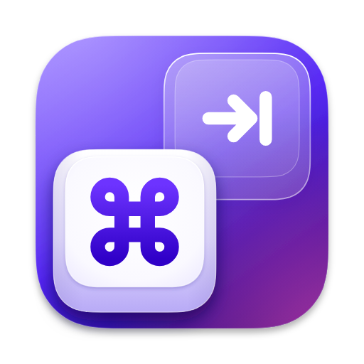
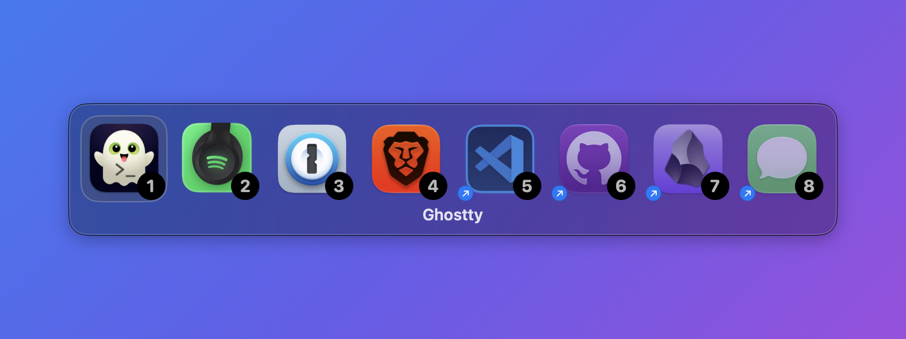
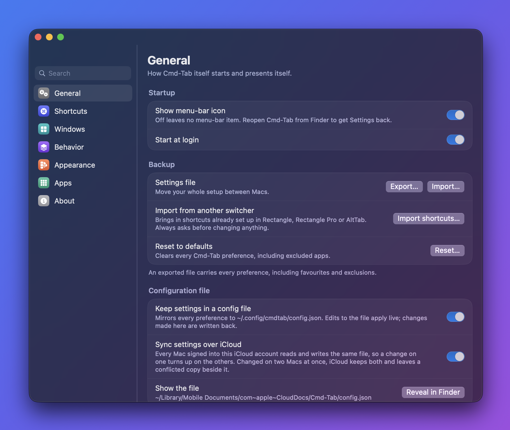

<p align="center">
  
</p>

# Cmd-Tab

A ⌘-Tab replacement for macOS, in the spirit of Command-Tab Plus 2. Switches between
**applications** or between **individual windows**. Runs on macOS 13 and later, on Apple silicon
and Intel.

Download the latest build from [Releases](https://github.com/kdbaustert/Cmd-Tab/releases). The
full documentation — building, every setting, how it works — is in
[docs/DOCUMENTATION.md](docs/DOCUMENTATION.md).

<p align="center">
  
</p>

<p align="center">
  
</p>

## Features

### Switching

- Switch between apps, or between every window across all apps.
- Rebindable trigger (⌘-Tab by default), plus optional extra shortcuts scoped to this app's
  windows, every window, the current display, the current Desktop, minimized windows, browser and
  terminal tabs, or the Desktops overview.
- A searchable Desktops overview: every window of every app, grouped under a header per Desktop.
- Keyboard and mouse navigation: arrows, ⌘-1…⌘-0 to jump straight to a tile, hover and click.
- Order by recent use or alphabetically; optionally group windows by app, limit to the current
  Desktop, or hide apps with no windows.
- Favorites pinned to the front, with dimmed launch tiles for favorites that aren't running.
- Per-app rules: exclude an app, give it its own shortcut, always list its windows individually,
  or keep tiling shortcuts away from it.
- Window-title rules to hide, expand or protect specific windows.
- Switching to an app whose windows are all minimized brings one back.

### Search

- Start typing to filter — fuzzy, ranked, and case- and accent-insensitive.
- Learned search shortcuts: committing a query remembers the app it chose and ranks it first next
  time.
- Launch installed apps straight from the filter.
- Optional fallbacks when nothing matches: open as a URL, search the web, or run as a shell
  command.

### Window actions

- Close, quit, force-quit, hide, hide others, minimize or zoom the highlighted tile without
  leaving the switcher — or move it to another display, or tile it to half the screen.
- Mark several tiles and act on all of them at once, or tile two to four of them side by side.

### Window management

- Keyboard tiling: halves, thirds, two-thirds, fourths, sixths, ninths, corners, maximize, almost
  maximize and center, with adjustable gaps.
- Tile or cascade every window on the display in one press.
- Resize, nudge, swap with a neighbor, and restore a window's size from before it was tiled.
- Move windows to another display or another Desktop — relatively, or straight to display 1–4 and
  desktop 1–9 by name.
- Snap by dragging a window to an edge or corner (a tiled window regains its old size when dragged out), or move and resize with a modifier-drag.
- Hide every window to show the desktop, then bring them all back.
- Move focus by direction, or let focus follow the pointer.
- Put windows back where they were when a set of monitors reconnects.
- Launch arrangements that place an app's first window on a chosen display and position.
- Import shortcuts from Rectangle, Rectangle Pro or AltTab, and see every binding — and every
  conflict — in one overview.

### Appearance

- Grid or list layout, with adjustable icon size, spacing and padding.
- Highlight color, a light, dark or system-matched appearance, and a glass material.
- Badges on each tile: its ⌘-number, unread counts from the Dock, and which display and Desktop
  it is on.
- Show the panel centered, on the active screen, or near the pointer, on one display or all of
  them.
- Optional live window previews and thumbnail tiles, plus a full-size preview on Space —
  Quick Look for the highlighted tile.
- VoiceOver support; English and French.

### Settings

- Searchable Settings window, menu-bar icon, and start at login.
- Export, import and reset all settings.
- Keep settings in a live config file (`~/.config/cmdtab/config.json`), or sync them across Macs
  through iCloud Drive.

### Automation

- `cmdtab://` URL scheme for tiling, focus and activation from any script.
- Native Shortcuts, Spotlight and Siri actions for the same set — no URL required.

### Updates

- Updates itself through Sparkle, with signed updates. Checks automatically; installing
  automatically is opt-in.

## Permissions

Cmd-Tab needs **Accessibility** access (System Settings → Privacy & Security → Accessibility) and
does nothing until it has it. **Screen Recording** is only needed for window previews, thumbnail
tiles and the full-size preview, all off by default.

Releases are not notarized yet, so the first launch needs right-click → **Open**, or
`xattr -cr /path/to/Cmd-Tab.app` in Terminal. See
[Ad-hoc releases](docs/DOCUMENTATION.md#ad-hoc-releases-no-apple-developer-program-membership).

## Privacy

No telemetry, analytics, crash reporting, or account. The only network request Cmd-Tab makes on
its own is the update check, which fetches the release feed from GitHub Pages and sends nothing
about you or your Mac.

## Contributing

Issues and pull requests are welcome. To build and test:

```sh
./build.sh --install  # builds build/Cmd-Tab.app, copies it to /Applications and launches it
swift test            # the pure-logic suite; CI runs it on every push and pull request
```

Building needs Xcode. Behavior that depends on the macOS version is covered by an opt-in
[Accessibility harness](docs/DOCUMENTATION.md#the-accessibility-harness) that runs locally. Before
changing how something works, read the matching section of the
[documentation](docs/DOCUMENTATION.md) — most of its sections explain why the code is the way it
is, and those reasons are easy to undo by accident.

## License

Cmd-Tab is licensed under the [GNU General Public License v3.0](LICENSE).

Built by [@kdbaustert](https://github.com/kdbaustert).
